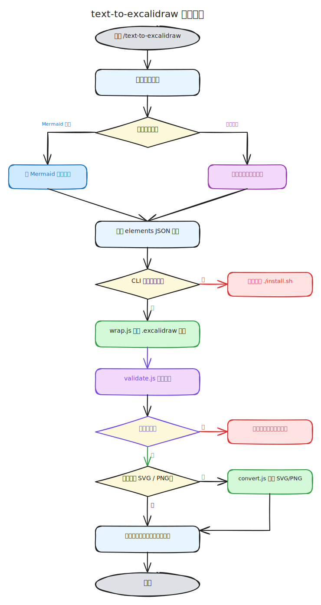
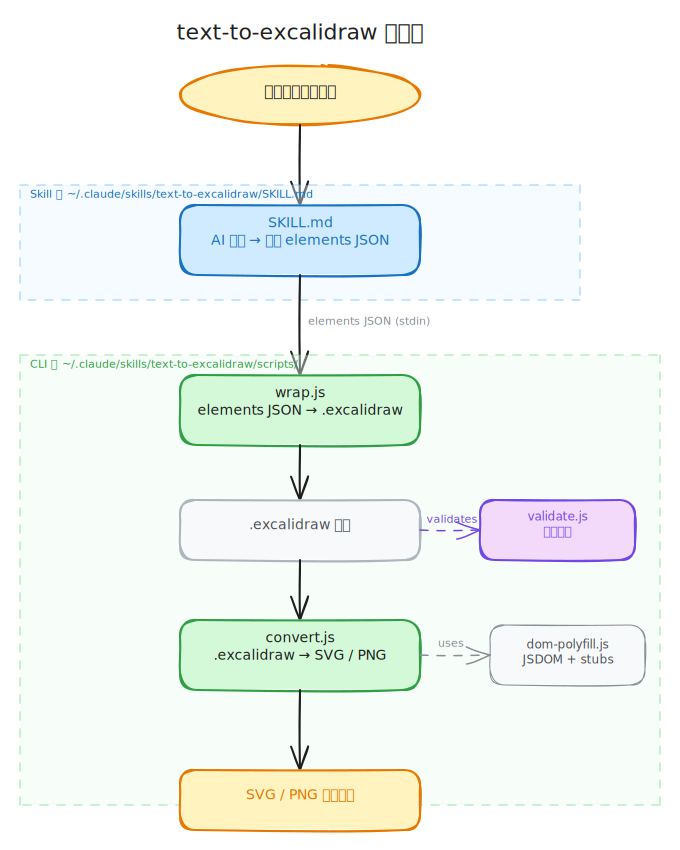

# text-to-excalidraw

将自然语言描述自动转换为 [Excalidraw](https://excalidraw.com) 图表文件的 Claude Code skill 和配套工具。

## 包含内容

| 组件 | 路径 | 说明 |
|---|---|---|
| Skill | `skills/text-to-excalidraw/` | 触发词识别、图表生成策略、Element schema 参考（兼容 Claude Code / OpenCode / OpenClaw）|
| CLI 工具 | `skills/text-to-excalidraw/scripts/` | `wrap.js`：elements JSON → `.excalidraw`；`convert.js`：`.excalidraw` → SVG / PNG |
| 安装脚本 | `install.sh` | 一键安装/卸载/验证，支持多平台 |

## 平台兼容性

| 工具 | 安装方式 | Skill 路径 |
|---|---|---|
| [Claude Code](https://docs.anthropic.com/claude-code) | `./install.sh` | `~/.claude/skills/text-to-excalidraw/` |
| [OpenCode](https://opencode.ai) | `./install.sh` | `~/.claude/skills/text-to-excalidraw/`（OpenCode 原生读取此路径）|
| [OpenClaw](https://github.com/openclaw/openclaw) | `./install.sh openclaw` | `~/.openclaw/skills/text-to-excalidraw/` |

## 系统要求

- Node.js >= 18
- 以下任意一个 AI 编码工具：
  - [Claude Code](https://docs.anthropic.com/claude-code)
  - [OpenCode](https://opencode.ai)
  - [OpenClaw](https://github.com/openclaw/openclaw)

## 快速安装

```bash
git clone https://github.com/chz34/text-to-excalidraw.git
cd text-to-excalidraw
```

### Claude Code / OpenCode

```bash
./install.sh
```

安装脚本会：
1. 检查 Node.js 版本
2. 将 skill（含 scripts/）复制到 `~/.claude/skills/text-to-excalidraw/`
3. 在 `scripts/` 目录运行 `npm install`
4. 运行单元测试
5. 执行功能验证

> **OpenCode 说明**：OpenCode 原生读取 `~/.claude/skills/`，与 Claude Code 共用同一安装路径，无需额外操作。

### OpenClaw

```bash
./install.sh openclaw
```

安装脚本会：
1. 检查 Node.js 版本
2. 将 skill（含 scripts/）复制到 `~/.openclaw/skills/text-to-excalidraw/`
3. 在 `scripts/` 目录运行 `npm install`
4. 运行单元测试
5. 执行功能验证

## 使用方式

安装完成后，在 AI 工具会话中：

**斜杠命令：**
```
/text-to-excalidraw 画一个用户注册流程图
/text-to-excalidraw 微服务架构图，包含 API Gateway、用户服务、订单服务、数据库
```

**对话触发（自动识别）：**
```
帮我画一张登录流程图
生成一个序列图，描述 HTTP 请求处理过程
draw a class diagram for a simple blog system
```

输出为 `.excalidraw` 文件，拖入 https://excalidraw.com 即可打开。

## 支持的图表类型

| 类型 | 示例描述 |
|---|---|
| 流程图 | "画一个 CI/CD 流程图" |
| 序列图 | "用户登录的时序图" |
| 类图 | "电商系统的 UML 类图" |
| 状态机 | "订单状态流转图" |
| ER 图 | "博客系统的数据库关系图" |
| 思维导图 | "前端技术栈思维导图" |
| 架构图 | "三层微服务架构，含负载均衡和数据库" |

## 导出为 SVG / PNG（可选）

生成 `.excalidraw` 文件后，可通过内置的 `convert.js` 导出为图片格式。

**技术方案**：SVG 经由 [`@excalidraw/utils`](https://github.com/excalidraw/excalidraw/tree/master/packages/utils)（含捆绑 TTF 字体）渲染；PNG 再经由 [`@resvg/resvg-js`](https://github.com/yisibl/resvg-js)（预编译 WASM，无需本地编译环境）转换。全链路纯 npm，无二进制安装依赖，跨平台兼容。

### 手动使用

```bash
# 导出为 SVG
node ~/.claude/skills/text-to-excalidraw/scripts/convert.js ./output.excalidraw --format svg

# 导出为 PNG
node ~/.claude/skills/text-to-excalidraw/scripts/convert.js ./output.excalidraw --format png

# 指定输出路径和缩放
node ~/.claude/skills/text-to-excalidraw/scripts/convert.js ./output.excalidraw --format png --scale 2 --out ./assets/diagram.png
```

### 在 AI 工具中触发导出

在对话中直接说明需要图片格式，skill 会自动处理：

```
/text-to-excalidraw 画一个登录流程图，导出为 SVG
帮我画一张架构图并保存为 PNG
```

## 其他脚本命令

```bash
./install.sh                     # 安装到 Claude Code / OpenCode（默认）
./install.sh openclaw            # 安装到 OpenClaw
./install.sh uninstall           # 卸载 Claude Code / OpenCode 版本
./install.sh uninstall-openclaw  # 卸载 OpenClaw 版本
./install.sh verify              # 验证安装是否正确
./install.sh test                # 只运行单元测试
```

## 运行测试

```bash
cd skills/text-to-excalidraw/scripts
node --test
```

预期输出：9 个测试全部通过。

## 工作原理

> 此处内容使用参考prompt生成：
```
/text-to-excalidraw 把当前项目的架构设计和流程分别画成一个示意图，并转换成svg内嵌到README中。
```

### 处理流程



### 组件架构



`@excalidraw/mermaid-to-excalidraw` 包需要浏览器 DOM 环境，无法在 Node.js CLI 中直接使用。因此采用 AI 直接生成 elements JSON 的方式，Mermaid 仅作为内部推理的结构框架。

## 文件结构

```
text-to-excalidraw/
├── README.md
├── LICENSE
├── install.sh
└── skills/
    └── text-to-excalidraw/
        ├── SKILL.md                   # Skill 定义（Claude Code / OpenCode / OpenClaw）
        └── scripts/                   # CLI 工具：elements[] → .excalidraw → SVG / PNG
            ├── package.json           # deps: @excalidraw/utils, @resvg/resvg-js, jsdom
            ├── wrap.js                # CLI + 库：elements JSON → .excalidraw 文件
            ├── convert.js             # CLI：.excalidraw → SVG / PNG（--format, --scale, --out）
            ├── validate.js            # CLI：.excalidraw 坐标校验（箭头/绑定/重叠检查）
            ├── dom-polyfill.js        # 共享模块：JSDOM 环境 + Path2D / FontFace stubs
            ├── wrap.test.mjs          # wrap.js 单元测试
            ├── convert.test.mjs       # convert.js 集成测试
            └── dom-polyfill.test.mjs  # dom-polyfill.js 单元测试
```

## 引用

| 项目 | 说明 | 许可证 |
|---|---|---|
| [excalidraw](https://github.com/excalidraw/excalidraw) | `.excalidraw` 文件格式及 element schema 定义来源 | MIT |
| [@excalidraw/utils](https://github.com/excalidraw/excalidraw/tree/master/packages/utils) | SVG 渲染引擎，含捆绑 TTF 字体 | MIT |
| [@resvg/resvg-js](https://github.com/yisibl/resvg-js) | SVG → PNG 渲染（预编译 WASM，跨平台） | MPL-2.0 |
| [jsdom](https://github.com/jsdom/jsdom) | Node.js 中模拟浏览器 DOM 环境 | MIT |

## License

[MIT](./LICENSE)
